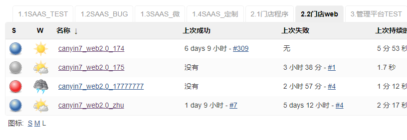
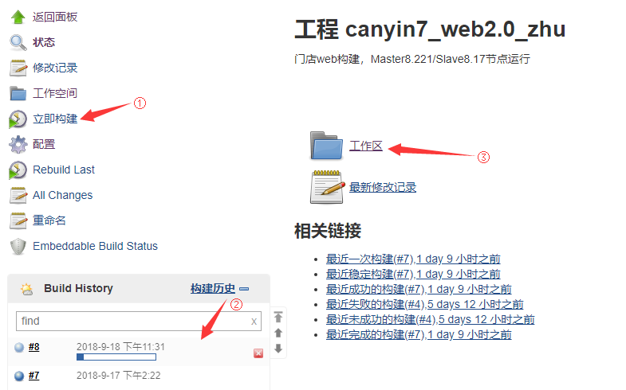
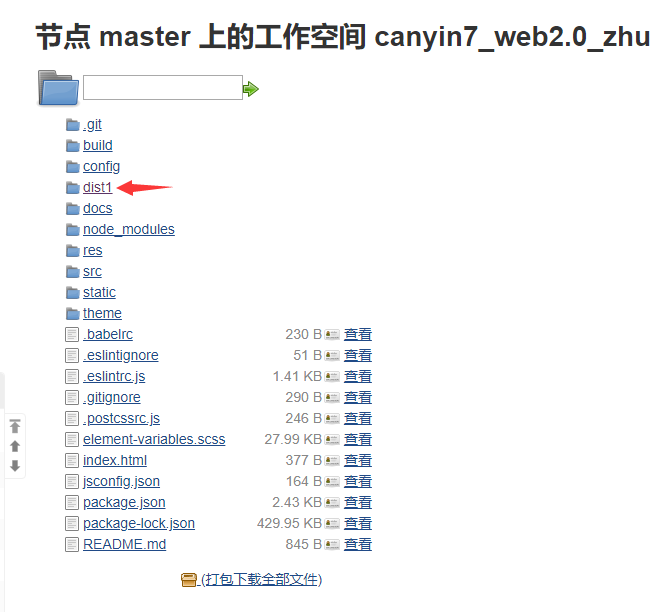
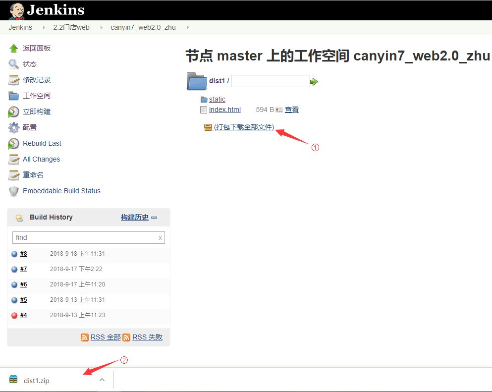
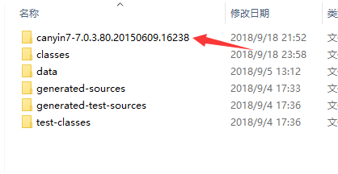
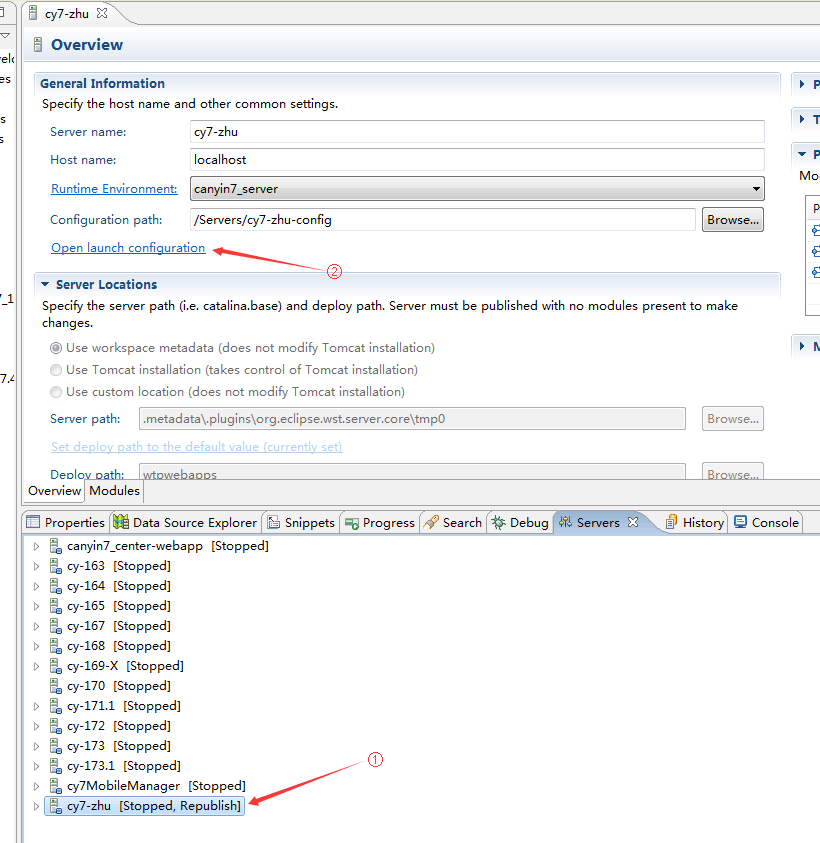
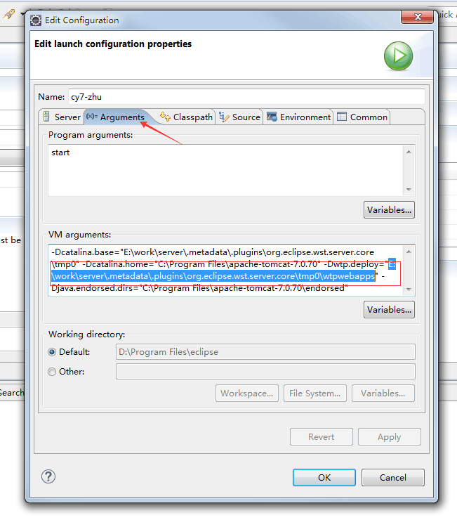
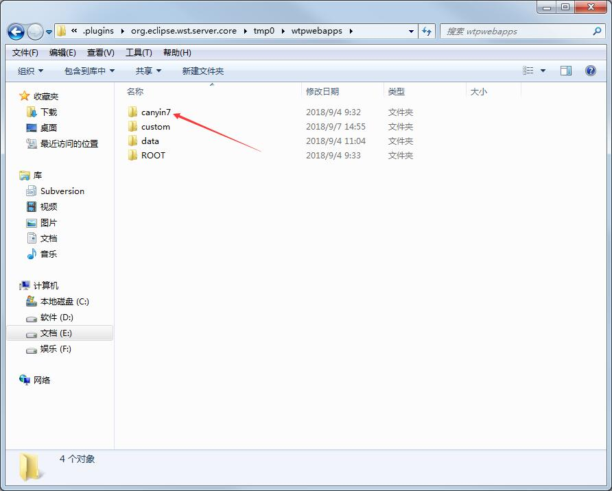

项目使用说明
==========

前台营业2.0在程序架构上与[餐饮7服务](https://git.wuuxiang.com/Cy7/canyin7)实现了完全的分离（俗称前后端分离），前端开发与后端开发分离开发（分项目开发、不用环境开发）。

本文档旨在衔接前后端开发人员之间的技术栈，说明项目的基本使用方法。

### 对于前端人员

- 通过“吾享餐饮服务管理器”启动餐饮7服务
- 通过 IDEA IDE 和其搭配的 Tomcat 服务提供后台服务
- 通过 Eclipse IDE 和其搭配的 Tomcat 服务提供后台服务

前端程序配置对应的 IP 地址进行 API 对接开发。

### 对于后端人员

- 通过 [webpack](https://webpack.js.org/) 编译前端程序
- 通过 [Jenkins](http://192.168.8.221:8080/view/2.2%E9%97%A8%E5%BA%97web/) 下载编译好的前端程序

然后放到指定目录下通过餐饮7程序访问页面。

开发前端程序
----------

前台营业2.0的前端开发使用了 [Vue.js](https://cn.vuejs.org/) 框架，并使用了 [webpack 模板](https://vuejs-templates.github.io/webpack/)（vue-cli，又称 Vue 脚手架工具）初始化项目。

### 需要安装

- [Node.js](https://nodejs.org/en/)

### 步骤

#### 1、安装依赖

安装完 Node.js 后会附带 [npm](https://www.npmjs.com/) 包管理器，建议安装[淘宝 NPM 镜像](http://npm.taobao.org/)，安装速度会更快一些，执行下面的命令：

```bash
$ npm install -g cnpm --registry=https://registry.npm.taobao.org
```

然后可通过 npm（或 cnpm）安装依赖，执行下面的命令：

```bash
$ npm install
```

或

```bash
$ cnpm install
```

#### 2、修改配置文件

在 ```config/index.js``` 中有开发代理服务器的配置，找到如下代码：

```js
proxyTable: {
  '/cy7': {
    target: 'http://192.168.8.225:7001',
    changeOrigin: true,
    pathRewrite: {
      '^/cy7': '/cy7'
    }
  }
},
```

将 ```192.168.8.225``` 替换成你需要连接的餐饮7服务对应的 IP 地址。

#### 3、启动开发环境

```bash
$ npm run dev
```

服务启动后访问 [http://localhost:8080](http://localhost:8080) （端口号如果被占用会自增）。

本机编译程序
----------

在上一章节中你已经安装好了 Node.js 并给程序安装好了依赖，那么通过如下命令就可以编译程序了。

```bash
$ npm run build
```

本项目的生产环境代码编译到目录 ```dist``` 中，后面会提到这个目录的作用。

通过 [Jenkins](http://192.168.8.221:8080) 编译前端程序
----------

- 访问 [http://192.168.8.221:8080](http://192.168.8.221:8080) 登录你的账号

- 如下图切换到**门店web**页签或直接访问 [http://192.168.8.221:8080/view/2.2门店web/](http://192.168.8.221:8080/view/2.2门店web/)



- 这里会列出几个项目，分别对应不用版本，我们拿主干项目举例，点击进入 ```canyin7_web2.0_zhu``` 项目，如下图点击左侧的【立即构建】按钮，待【构建历史】中新的构建进度完成后，进入【工作区】



- 进入工作区，我们能看到 ```dist``` 目录，点击进入



- 在 ```dist``` 目录中点击【打包下载全部文件】，浏览器会开始下载名为 ```dist.zip``` 的压缩包



- 解压下载好的 ```dist.zip```，我们会同样得到一个编译好的 ```dist``` 目录，后面会提到这个目录的作用。

> 我们得到的 ```dist``` 目录将用于以下三种场景

用于标准餐饮7程序
----------

将 ```dist``` 目录放入到餐饮7安装目录的 ```program``` 目录下即可。

用于 IDEA 开发环境
----------

在 IDEA 的开发环境中，会在项目中构建出 ```target``` 目录，如下图会看到一个 ```canyin7-``` 为前缀的目录



将 ```dist``` 目录放入到这个目录下就可以查看新版的前台营业了。

用于 Eclipse 开发环境
----------

1. 在 Eclipse 的 【Servers】中找到餐饮7的服务项，如下图 ① 双击它，这时会打开服务的基本设置，点击【Open launch configuration】，打开配置对话框



2. 在配置对话框中打开【Arguments】页签，在下面的【VM arguments】一栏中找到 ```Dwtp.deploy``` 的值，如下图所示的 ```E:\work\server\.metadata\.plugins\org.eclipse.wst.server.core\tmp0\wtpwebapps```，复制这段目录



3. 打开复制好的目录，会看到里边含有一个 ```canyin7``` 的目录，将 ```dist``` 目录放到这个目录下


